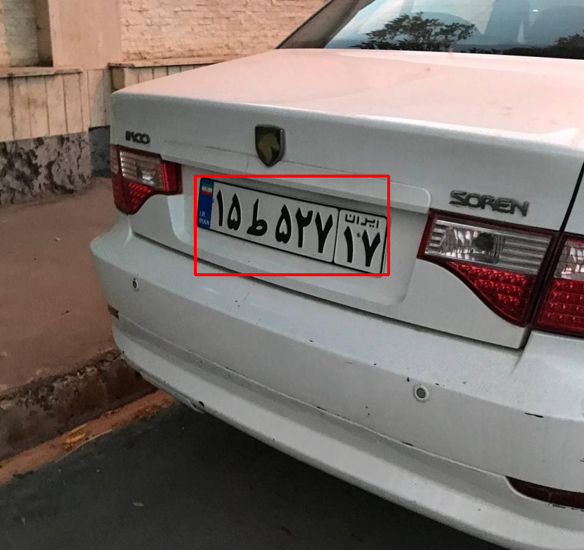
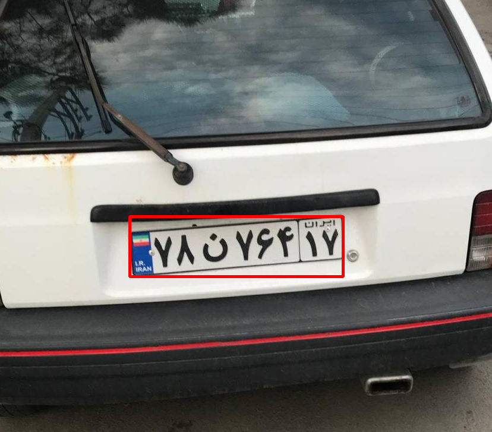

# 🚘 Car Plate Detection with YOLO  

Este projeto implementa uma **rede neural baseada em YOLO** para detectar placas de carros em imagens.  
Ele oferece suporte tanto ao **treinamento de modelos personalizados** quanto à **inferência em imagens** usando pesos já treinados.  

## 📌 Funcionalidades  

- 📊 **Treinamento de modelo YOLO** com dataset customizado.  
- 🔍 **Detecção de placas de carros** em imagens.  
- 🖼️ Visualização das predições com bounding boxes em vermelho.  
- ⚡ Suporte para **GPU (CUDA)** ou **CPU**.  
- 🛠️ Código modular com separação em `Trainer` e `Detector`.  

---

## 📂 Estrutura do Projeto  

```
.
├── app/
│   ├── trainer.py      # Classe responsável pelo treinamento
│   ├── detector.py     # Classe responsável pela inferência
├── dataset/            # Dataset local para treino
│   └── plate_detection/data.yaml
├── pretrained/
│   └── best.pt         # Pesos pré-treinados
├── main.py             # Arquivo principal do sistema
```

---

## 📦 Dependências  

- Python 3.10+  
- OpenCV  
- Ultralytics YOLO (v11)  
- Torch  

Instale as dependências com:  

```bash
pip install -r requirements.txt
```

Exemplo de `requirements.txt`:  

```
torch
torchvision
torchaudio
ultralytics
opencv-python
```

---

## 🚀 Como Usar  

### 🔧 1. Treinar o modelo  

```bash
python main.py --train True
```

- O modelo será treinado com os parâmetros configurados em `Trainer`.  
- Após o treino, os melhores pesos serão salvos em:  

```
runs/detect/plate-detection/weights/best.pt
```

Para utilizar esses pesos, basta atualizar a variável `MODEL_PATH` no código.  

---

### 🖼️ 2. Detectar placa em uma imagem  

```bash
python main.py --image caminho/da/imagem.jpg
```

- O sistema carregará os pesos em `MODEL_PATH`.  
- Uma janela será aberta exibindo a imagem com a placa detectada.  

---

## 🧠 Dataset  

Este projeto utiliza o dataset do Kaggle:  
📌 [Car Plate Detection - YOLOv8](https://www.kaggle.com/datasets/nimapourmoradi/car-plate-detection-yolov8)  

---

## 📒 Notebook de Referência  

O desenvolvimento foi inspirado neste notebook:  
📌 [Car Plate Detection - YOLO11 (mAP 99.1%)](https://www.kaggle.com/code/bilalakgz/car-plate-detection-yolo11-map-99-1)  

---

## 🎯 Exemplo de Resultado  

> Exemplo de detecção de placa em uma imagem:  


---

## 📜 Licença  

Este projeto é de uso livre para fins acadêmicos e de pesquisa.  
